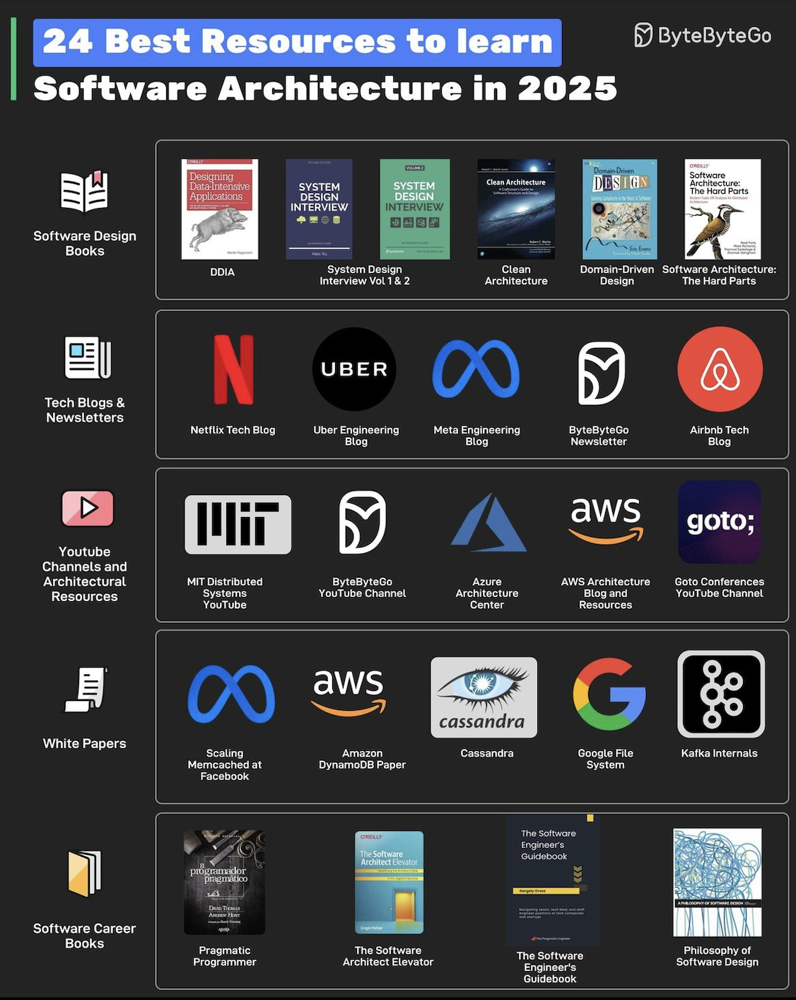

# System Design

- [ByteByteGoHq/system-design-101](https://github.com/ByteByteGoHq/system-design-101)
- [系统设计入门指南：5个必须掌握的知识点 | 程序员面试, 分布式系统, 后端](https://www.youtube.com/watch?v=8TE2DvpKxvA&ab_channel=SchelleyYuki)
    1. Load Balancer：負載均衡 -> ELB
    2. DataBase Design：資料庫設計
    3. Caching：緩存設計
    4. CDN -> CF
    5. Async Processing：異步設計

- https://aws.amazon.com/tw/solutions/case-studies/tixcraft/
- https://tw.twincl.com/programming/*641y
- https://www.youtube.com/watch?v=QJzkifQ-Cuk
- https://www.youtube.com/watch?v=lNQAl71Abqc
- https://www.youtube.com/watch?v=GxhPQl2guXM